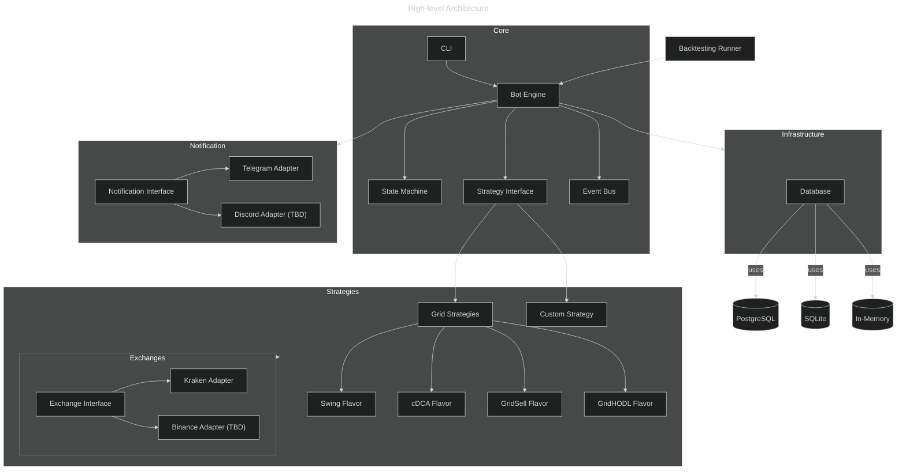

# Pluggable Multi-Exchange Crypto Grid Trading Bot

## Background

The Kraken Infinity Grid is a cryptocurrency trading algorithm originally
designed to operate on the Kraken exchange using a grid-based strategy. Over
time, it evolved to support multiple strategic "flavors", such as continuous
DCA-style buying, conditional swing selling, and symmetric quote-based
buying/selling for base accumulation. The initial design focused on a single
exchange and static configuration.

As community interest and the need for extensibility grew, the architecture is
being redesigned to support:

- Multiple exchange integrations (e.g., Kraken, Binance)
- Easily swappable and extendable strategy implementations
- Clear separation of concerns between strategy logic, exchange-specific APIs,
  and infrastructure
- Testability for unit and acceptance testing, including support for backtesting
  historical data
- A CLI-based, single-bot-per-instance execution model via Docker containers
  with asynchronous processing through WebSockets
- Persistent state stored in an external PostgreSQL or SQLite database

This redesign aims to empower community developers to contribute their own
strategies and exchange integrations with minimal coupling, through a clean
architecture that emphasizes modularity and extensibility.

## Requirements

The following are the functional and non-functional requirements for the redesigned trading bot platform:

### Must Have

- Support for executing a single strategy (of any type) on a single exchange instance per run
- Strategy plugin architecture: ability to register and run different types of trading strategies (e.g., grid, event-driven)
- Strategy subtype system (e.g., "flavors" for grid strategy)
- Exchange abstraction via interface to support Kraken initially and later other exchanges (e.g., Binance, Coinbase)
- Pluggable database backend with support for PostgreSQL (production), SQLite, and in-memory (testing/backtesting)
- Persistent storage of trades, orders, balances, and strategy state
- Asynchronous processing for order events and market data (WebSocket-based)
- Robust unit and acceptance testing framework with strategy mocking and historical replay for backtesting
- CLI-based control using `cloup` for launching and managing bot instances
- Basic error handling, logging, and recovery mechanisms

### Should Have

- Notification adapter interface for pluggable services (e.g., Telegram, Slack)
- Dynamic configuration loading for strategies (via JSON/YAML or CLI params)
- Strategy-specific database schema registration and migration
- Support for dry-run mode (no real orders placed)
- GUI for configuring, monitoring, and launching strategies (desktop or web-based)

### Could Have

- Central monitoring dashboard for running bots
- Metrics endpoint (Prometheus-compatible)

### Won't Have (For Now)

- Concurrent multi-strategy or multi-exchange runs in the same container
- Full high-availability or distributed task execution (may be explored for future strategy scaling)

## Method

### Architecture Overview

The application is designed following a clean hexagonal architecture with clear
separation between domain logic (core), strategy plugins, infrastructure
services, and external adapters. Below is a high-level component view:



- Strategies are plugins implementing StrategyInterface, optionally subclassing
  existing ones like GridStrategy.
- Exchanges are plug-and-play via ExchangeInterface.
- Adapters convert external APIs (e.g., Kraken, Telegram) into standard interfaces.
- Bot Engine manages execution, interacts with state machine, and orchestrates flow.
- Database Layer can be PostgreSQL (prod), SQLite (lightweight), or in-memory
  (testing).

## Exchange-Strategy Compatibility

Strategies declare what they need, and exchanges declare what they offer:

```python
class ExchangeMetadata:
    supports_ohlc: bool
    supports_market_order: bool
    supports_partial_fills: bool
    supports_websocket_trades: bool
    ...
```
