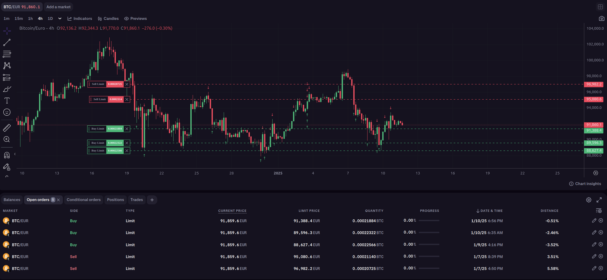
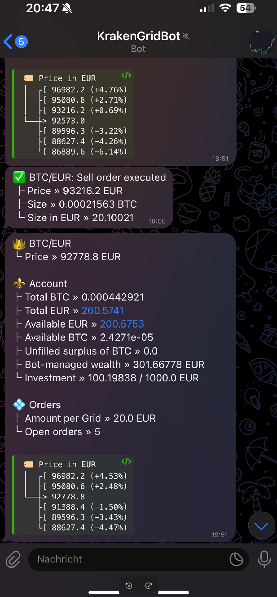

.. -*- mode: rst; coding: utf-8 -*-
..
.. Copyright (C) 2025 Benjamin Thomas Schwertfeger
.. All rights reserved.
.. https://github.com/btschwertfeger
..

.. _getting-started-section:

Getting Started
===============

Before installing and running the `infinity-grid`_, you need to
make sure to clearly understand the available trading strategies and their
configuration. Avoid running the algorithm with real money before you are
confident in the algorithm's behavior and performance!

Preparation
-----------

Depending on the used exchange, different preparatory steps might be needed. In
the following, the steps for use with the Kraken Crypto Asset Exchange is shown:

1. In order to trade at the `Kraken`_ Cryptocurrency Exchange, you need to
   generate API keys for the Kraken exchange. You can do this by following the
   instructions on the `Kraken`_ website (see `How to create an API key
   <https://support.kraken.com/hc/en-us/articles/360000919966-How-to-create-an-API-key>`_).
   Make sure to generate keys with the required permissions for trading and
   querying orders:

    .. figure:: _static/images/kraken_api_key_permissions.png
        :width: 600
        :align: center
        :alt: Kraken API Key Permissions

2. [optional] The algorithm leverages Telegram Bots to send notifications about
   the current state of the algorithm. We need two, one for the notifications
   about the algorithm's state and trades and one for notifications about
   errors.

   - Create two bots, name as you wish via: https://telegram.me/BotFather.
   - Start the chat with both new Telegram bots and write any message to ensure
     that the chat ID is available in the next step.
   - Get the bot token from the BotFather and access
     ``https://api.telegram.org/bot<your bot token here>/getUpdates`` to receive
     your chat ID.
   - Save the chat IDs as well as the bot tokens for both of them, we'll need
     them later.

.. _getting-started-docker-compose-section:

Running via Docker Compose
--------------------------

The repository of the `infinity-grid`_ contains a ``docker-compose.yaml``
file that can be used to run the algorithm using Docker Compose. This file also
provides a default configuration for the PostgreSQL database. To run the
algorithm, simply copy it's contents and run ``docker compose up -d`` and watch
the logs.

Monitoring
----------

Trades as well as open positions can be monitored at the exchanges', where they
can also be managed. Keep in mind that canceling via UI is possible, but placing
orders that the algorithm will manage is not possible, as it only manages orders
that it has placed.

Additionally, the algorithm can be configured to send notifications about the
current state of the algorithm via Telegram Bots (see :ref:`Preparation
<getting-started-section>`).

