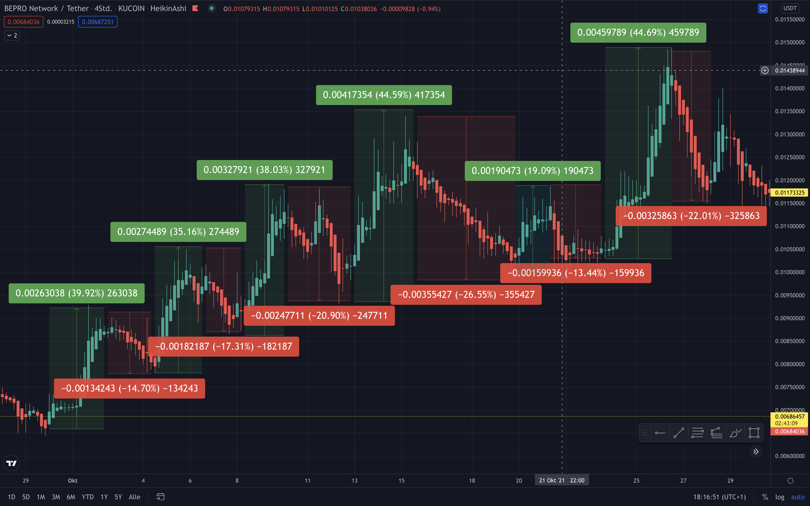

.. -*- mode: rst; coding: utf-8 -*-
..
.. Copyright (C) 2025 Benjamin Thomas Schwertfeger
.. All rights reserved.
.. https://github.com/btschwertfeger
..

.. _strategies-section:

Strategies
==========

.. WARNING:: Trading always involves risks. The following strategies are
             illustrative examples and should not be considered as financial
             advice. The author is not responsible for any losses incurred by
             using the following strategies. The user should always be aware of
             the risks involved in trading and should only invest money that he
             or she can afford to lose.

Terms and definitions
---------------------

- **Base currency**: The base currency is the currency that is being bought and
  sold, e.g. BTC. for the symbol BTC/EUR.

- **Quote currency**: The quote currency is the currency that is being used to
  buy and sell the base currency, e.g. EUR. for the symbol BTC/EUR.

- **Price**: The price is the current price of the base currency in terms of the
  quote currency, e.g. 100,000 USD for 1 BTC, 100,000 is the price.

- **Grid interval**: The grid interval is the percentage difference between the
  placed buy orders, e.g. 4 %. If the current price rises 'too high', the placed
  buy orders will be cancelled and new buy orders will be placed 'interval' %
  below the current price (shifting up). The interval for buy orders is always
  based on the current price or the next higher buy order, e.g. if the current
  price is 100,000 USD and the interval is 4 %, the first buy order will be
  placed at 96,000 USD, the second buy order at 92,160 USD, the third buy order
  at 88,4736 USD, and so on. The interval for sell orders is usually based on
  the buy price, e.g. if the buy price was 100,000 USD, the sell order will be
  placed for 104,000 USD.

- **Shifting up**: Shifting up is the process of canceling and replacing the buy
  orders if the current price rises above a certain threshold, which is
  :math:`(p\cdot(1+i))^2*1.001` where :math:`p` is the highest price of an
  existing, unfilled buy order and :math:`i` is the interval (e.g. 4 %, i.e.
  0.04). This technique ensures that buy orders don't get out of scope.

Fundamental concepts
--------------------

`infinity-grid`_ is a sophisticated trading algorithm designed for automated
cryptocurrency trading using a grid strategy. This approach is particularly
effective in volatile markets, where frequent price fluctuations allow for
consistent profit opportunities through structured buying and selling patterns.

The core idea: Grid trading
~~~~~~~~~~~~~~~~~~~~~~~~~~~

At its essence, grid trading aims to capitalize on market volatility by setting
a series of buy and sell orders at predefined intervals. The algorithm operates
within a "grid" of prices, purchasing assets when prices dip and selling them as
prices rise. This systematic approach helps in capturing small gains repeatedly,
leveraging the natural oscillations in market prices.

*All currency pairs mentioned here are for illustrative purposes only.*

Key Elements of Grid Trading
~~~~~~~~~~~~~~~~~~~~~~~~~~~~

1. **Intervals**: Unlike fully static systems, `infinity-grid`_ uses
   fixed intervals that shift up or down based on price movements, ensuring
   continuous trading and avoids manual interactions. This flexibility is
   crucial for maintaining profitability in diverse market environments.

2. **Volatility Advantage**: High volatility is a friend to grid traders. The
   more the price oscillates, the more opportunities arise to buy low and sell
   high. The algorithm thrives in such conditions, with each price movement
   potentially triggering a profitable trade.

3. **Consistent Position Sizing**: Each trade involves a consistent volume in
   terms of the quote currency (e.g., \\$100 per trade). This uniformity
   simplifies the management of trades and helps in maintaining a balanced
   portfolio.

Risk Management and Reinvestment
~~~~~~~~~~~~~~~~~~~~~~~~~~~~~~~~

1. **Risk Mitigation**: The algorithm inherently incorporates risk management by
   spreading investments across multiple price levels and maintaining almost
   consistent trade sizes. This diversification reduces the impact of adverse
   market movements on the overall portfolio.

2. **Reinvestment Mechanism**: Accumulated profits can be reinvested, enhancing
   the trading capital and potential returns. The algorithm automatically
   adjusts buy and and places sell orders to reflect the increased capital, thus
   compounding growth over time.

Available strategies
--------------------

Each of the following strategies is designed to leverage different aspects of
market behavior, providing flexibility and adaptability to traders depending on
their risk tolerance, market outlook, and investment goals.

.. _strategies-gridhodl-section:

GridHODL
~~~~~~~~

The *GridHODL* strategy operates on a predefined grid system where buy and sell
orders are placed at fixed intervals below and above the current market price,
respectively. This strategy is designed to capitalize on market fluctuations by
buying low and selling high, ensuring gradual accumulation of the base currency
over time.

Technical Breakdown:

- **Order Placement**: The algorithm dynamically adjusts :math:`n` buy orders
  below the current market price. For example, with a 4% interval, if the
  current BTC price is \\$50,000, the first buy order is set at \\$48,000, the
  second at $46,080, and so on.
- **Execution**: Upon execution of a buy order, a corresponding sell order is
  immediately placed at 4% above the purchase price respecting a fixed quote
  volume. This creates a cycle of continuous buying and selling, with each cycle
  aiming to yield a small portion in the base currency.
- **Accumulation**: Unlike traditional trading strategies, GridHODL is designed
  to accumulate the base currency gradually. Each buy order slightly increases
  the holdings, while the fixed order size in terms of quote currency (e.g.,
  \\$100) ensures consistent exposure.

This strategy is particularly effective in sideways, slightly, and high volatile
markets, where frequent price oscillations allow for regular execution of the
grid orders. Accumulating the base currency over time can lead to significant
gains, especially when prices rise after a long accumulation phase.

.. _strategies-gridsell-section:

GridSell
~~~~~~~~

The *GridSell* is a complementary approach to :ref:`GridHODL`, focusing on
liquidating the purchased base currency in each trade cycle to realize immediate
profits. The key distinction is that each sell order matches the total quantity
bought in the preceding buy order.

Technical Breakdown:

- **Order Logic**: For every buy order executed (e.g., purchasing \\$100 worth
  of BTC at \\$48,000), a sell order is placed for the entire amount of BTC
  acquired at a 4% higher price. This ensures that each trade cycle results in a
  complete turnover of the base currency.
- **Profit Realization**: The strategy ensures that profits are locked in at
  each cycle, reducing the need for long-term accumulation or holding. It is
  particularly suitable for traders who prioritize short-term gains over base
  currency accumulation.
- **Risk Mitigation**: By liquidating the entire bought amount, the GridSell
  strategy minimizes exposure to prolonged market downturns, ensuring that the
  trader consistently realizes profits without holding onto assets for extended
  periods.

.. _strategies-swing-section:

SWING
~~~~~

The *SWING* strategy builds upon `GridHODL`_ but introduces a mechanism to
capitalize on significant upward price movements by selling accumulated base
currency at higher levels.

Technical Breakdown:

- **Market Adaptation**: This strategy tracks the highest buy price within a
  defined range (e.g., \\$40,000 to \\$80,000). If the market price exceeds this
  range (e.g., rises to \\$83,200), the algorithm initiates sell orders at
  predefined intervals (e.g., 4% above the highest buy price).
- **Sell Execution**: Unlike `GridHODL`_, which focuses on buying and selling in
  cycles, SWING starts selling accumulated base currency once the price
  surpasses the highest recorded buy price. This ensures that profits are
  captured during bullish market trends.
- **Continuous Accumulation**: Even as it initiates sell orders above the
  highest buy price, the algorithm continues to place buy orders below it,
  ensuring that base currency accumulation continues during market dips.
- **Profit Maximization**: This dual approach allows traders to benefit from
  both upward trends (through sell orders) and downward corrections (through
  continued accumulation).

.. NOTE:: ⚠️ It also starts selling the already existing base currency above the
          current price. This should be kept in mind when choosing this
          strategy.

.. _strategies-cdca-section:

cDCA
~~~~

The *cDCA* (Custom Dollar-Cost Averaging) strategy diverges from traditional DCA
by incorporating dynamic interval adjustments to optimize long-term accumulation
of the base currency.

Technical Breakdown:

- **Fixed Interval Purchases**: Unlike time-based DCA, cDCA places buy orders at
  fixed percentage intervals (e.g., every 4% price movement) rather than at
  regular time intervals. This ensures that purchases are made in response to
  market movements rather than arbitrary time frames.
- **No Sell Orders**: cDCA focuses purely on accumulation. It consistently buys
  the base currency (e.g., \\$100 worth of BTC) at each interval without placing
  corresponding sell orders, banking on long-term price appreciation.
- **Adaptive Buy Orders**: The algorithm adapts to rising prices by shifting buy
  orders upward rather than letting them fall out of scope. For instance, if the
  price exceeds \\$60,000, new buy orders are placed at 4% intervals below this
  new level, maintaining relevance in the current market context.
- **Long-Term Growth**: This strategy is ideal for traders with a long-term
  investment horizon, aiming to build a significant position in the base
  currency over time, with the expectation of future price increases.

Example of Grid Trading
-----------------------

Suppose you are trading BTC/USD and set your interval at 4%.

- Current BTC price: \\$50,000
- Position size: \\$100 per trade

**Scenario 1: Using GridHODL Strategy**

1. The algorithm places limit buy orders at intervals below the current price,
   for example:

- Buy \\$100 worth of BTC at \\$48,000 (4% below \\$50,000)
- Buy \\$100 worth of BTC at \\$46,080 (another 4% below \\$48,000)

2. Once a buy order executes, a corresponding sell order is placed 4% above the
   purchase price:

- Sell the BTC bought at \\$48,000 for \\$100 at \\$49,920 (4% above \\$48,000)

This process accumulates BTC over time since the sell orders are always slightly
less in BTC terms than the buy orders due to the fixed USD amount.

**Scenario 2: Using GridSell Strategy**

1. A buy order for \\$100 of BTC is placed at \\$48,000.
2. Upon execution, a sell order for the full amount of BTC purchased is placed
   4% higher:

- Sell BTC for \\$104 at \\$49,920.

This strategy focuses on liquidating the bought BTC entirely for each trade
cycle.

**Scenario 3: Using SWING Strategy**

1. Assume the algorithm has been trading between \\$40,000 and \\$80,000, with
   the highest buy at \\$80,000.
2. As long as the price do not exceed \\$80,000, the algorithm continues to buy
   and sell BTC at 4% intervals just like the GirdHODL strategy.
3. If the price rises to \\$83,200 (4% above \\$80,000), the algorithm starts
   placing sell orders for the accumulated BTC:

- Sell \\$100 worth of BTC at \\$83,200.

This strategy sells accumulated BTC when the price exceeds the highest buy,
while continuing to buy if prices fall below the highest purchase.

**Dollar-Cost Averaging with cDCA**

The cDCA strategy simplifies the process by consistently buying at fixed
intervals:

- Interval: Every 4% price change
- Purchase size: \\$100 per interval

Example:

- Buy \\$100 of BTC at \\$50,000.
- If the price drops to \\$48,000, buy another \\$100 worth of BTC.
- If the price rises to \\$52,000, continue buying \\$100 worth of BTC,
  adjusting the buy orders upwards.

This strategy accumulates BTC over time without selling, speculating on
long-term price increases.

The "c" in cDCA stands for "custom", as it does not follow the traditional DCA
strategy of buying at fixed time intervals. Instead, if the price rises above
e.g. 60,000 USD, the algorithm will shift-up buy orders instead of getting out
of scope, i.e. it will place buy orders at 4 % intervals below 60,000 USD.

**Key Concepts**

1. Interval Setting: Before trading, the user must define the interval size,
   e.g., 2% or 4% between orders.
2. Position Size: The volume of each trade remains constant in quote currency
   terms (e.g., \\$100 per trade).
3. Accumulation: With strategies like GridHODL and SWING, each buy and sell
   cycle leads to a small accumulation of the base currency.
4. Reinvestment: The accumulated base currency can be reinvested. Once there are
   no open sell positions, a new sell order is set for the defined position
   volume above the highest buy price. This reinvestment increases the stock of
   the quote currency.

**Example of Reinvestment in Swing Strategy**

- Accumulated BTC: 0.05 BTC
- Highest buy price: \\$80,000

If the BTC price rises to \\$83,200:

- Sell 0.05 BTC at \\$83,200.

If this cycle repeats and the quote currency (USD) surpasses a certain
threshold, the position size for future trades can be increased, enhancing
profitability for subsequent trades.
